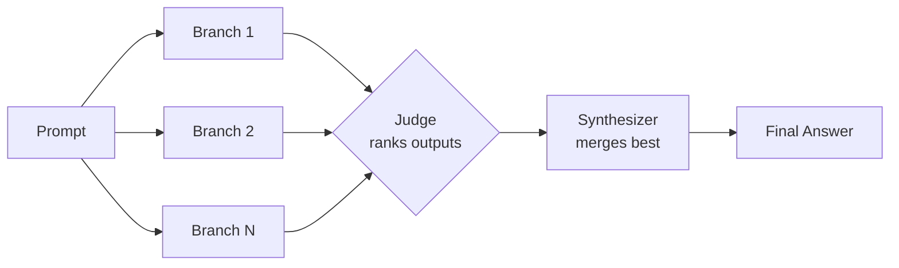

# OpenFusion

> Fan one prompt out to many models, let a judge rank the answers, and synthesize the best of all into one.


OpenFusion is a compound model orchestration tool. It sends a single prompt to N model branches in parallel, has a judge model rank the outputs, and uses a synthesizer model to merge them into one final answer. One file, pure Python 3 standard library, zero dependencies.

## Flow



## Features

- Parallel fan-out to N model branches from a single prompt
- Judge model ranks branch outputs by quality
- Synthesizer model combines ranked outputs into one coherent answer
- Multi-provider: OpenAI, Anthropic Claude, Google Gemini, OpenRouter, and any OpenAI-compatible endpoint
- Mix providers and models freely within a single run
- Configuration via `fusion.json` with reusable named configs
- Pure Python 3 standard library, no `pip install` required
- Final answer to stdout, progress and diagnostics to stderr (clean piping)

## Quickstart

Set the API keys for the providers you intend to use:

```bash
export OPENAI_API_KEY="sk-..."
export ANTHROPIC_API_KEY="sk-ant-..."
export GEMINI_API_KEY="..."
```

Run with an ad-hoc set of models:

```bash
python3 fusion.py \
  --models openai/gpt-4o,anthropic/claude-sonnet-4,gemini/gemini-2.0-flash \
  --judge openai/gpt-4o \
  --synth anthropic/claude-sonnet-4 \
  "Review this auth middleware for security issues"
```

Or run a named config from `fusion.json`:

```bash
python3 fusion.py code-review "Review this auth middleware for security issues"
```

Pipe the final answer straight to a file (progress stays on stderr):

```bash
python3 fusion.py code-review "$(cat patch.diff)" > review.md
```

## Configuration

OpenFusion reads providers and named configs from `fusion.json` next to the runner.

```json
{
  "providers": {
    "openai": {
      "base": "https://api.openai.com/v1",
      "shape": "openai",
      "auth": "bearer",
      "key_env": "OPENAI_API_KEY"
    },
    "anthropic": {
      "base": "https://api.anthropic.com/v1",
      "shape": "claude",
      "auth": "x-api-key",
      "key_env": "ANTHROPIC_API_KEY",
      "headers": { "anthropic-version": "2023-06-01" }
    },
    "gemini": {
      "base": "https://generativelanguage.googleapis.com/v1beta",
      "shape": "gemini",
      "auth": "x-goog-api-key",
      "key_env": "GEMINI_API_KEY"
    }
  },
  "configs": {
    "code-review": {
      "branches": [
        { "model": "openai/gpt-4o", "prompt": "Review for correctness and bugs.", "timeout": 120000 },
        { "model": "anthropic/claude-sonnet-4", "prompt": "Review for security and edge cases.", "timeout": 120000 },
        { "model": "gemini/gemini-2.0-flash", "prompt": "Review for simplicity and readability.", "timeout": 120000 }
      ],
      "judge": { "model": "openai/gpt-4o", "prompt": "Rank the branch outputs." },
      "synthesizer": { "model": "anthropic/claude-sonnet-4", "prompt": "Merge into one final answer." },
      "limits": { "timeout": 180000, "maxBranches": 8 }
    }
  }
}
```

Provider `shape` selects the request format (`openai`, `claude`, or `gemini`). Use `openai` for OpenAI and any OpenAI-compatible endpoint. Models are referenced as `provider/model`.

## CLI Usage

```
python3 fusion.py <config> <prompt>
python3 fusion.py --models p/m1,p/m2[,...] [--judge p/mJ --synth p/mS] <prompt>
```

| Argument | Description |
| --- | --- |
| `<config>` | Name of a config defined under `configs` in `fusion.json` |
| `<prompt>` | The prompt to fan out to all branches |
| `--models` | Comma-separated list of `provider/model` branches |
| `--judge` | Model used to rank branch outputs (optional) |
| `--synth` | Model used to synthesize the final answer (optional) |

If `--judge` or `--synth` are omitted, OpenFusion falls back to the first branch model for those roles.

## Use Cases

- **Code review** — independent reviewers catch different issues, the synthesizer consolidates findings
- **Architecture tradeoffs** — compare reasoning across models before committing to a design
- **Self-critique** — route a draft through multiple critics and merge the strongest objections
- **Migration planning** — surface risks and sequencing that a single model would miss
- Any high-stakes decision that benefits from independent perspectives rather than one opinion

## How It Works

1. **Fan-out.** The prompt is dispatched to every branch model concurrently using a thread pool. Each branch produces an independent answer.
2. **Judge.** The judge model receives all branch outputs and ranks them by quality, producing an ordered assessment with rationale.
3. **Synthesize.** The synthesizer model receives the original prompt, the branch outputs, and the judge's ranking, then merges them into a single final answer that draws on the strongest elements of each.
4. **Output.** The final answer is written to stdout. Branch progress, the judge's ranking, and timing details are written to stderr so you can pipe the result cleanly.

Because branches run in parallel, total latency is roughly the slowest branch plus the judge and synthesis passes, not the sum of every call.
